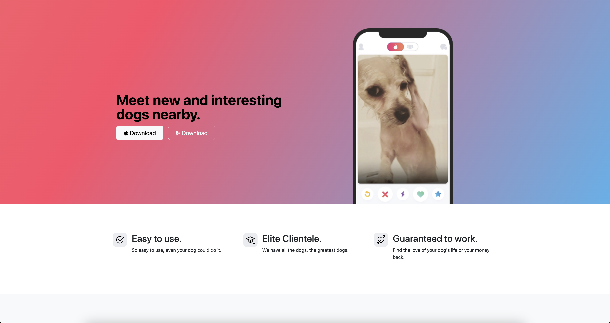

# Tindog

[](#)
> A single-page website made with Bootstrap. It features a hero section, pricing plans, and testimonials, designed around the concept of "Tinder for dogs."

## Overview

**Tindog ** is a fun and interactive landing page designed to resemble a dating app for dogs. Built using Bootstrap, it provides a sleek, responsive design with well-structured UI components. The website showcases different features like membership plans, testimonials, and a CTA for downloading the app.


## Preview

<p align="center">
  
</p>

## Features

- **Responsive Design:** Built with Bootstrap to ensure compatibility across devices.
- **Hero Section:** Engaging introductory section with a call-to-action.
- **Pricing Plans:** Clear and structured pricing cards for different membership levels.
- **Testimonials:** User reviews displayed in an interactive and visually appealing format.
- **Download Buttons:** Styled buttons to prompt users to download the app.

## Live Demo

**Explore the live version here:** [View Live Demo](https://marius-bogdan.com/projects/tinder-for-dogs/)

## Local Setup

1. **Clone** the repository:
   ```bash
   git clone https://github.com/MIBogdan/tinder-for-dogs.git
   ```
2. **Open** the `index.html` file in your browser
   *- or use a local development server (like VS Code Live Server) for a smoother development experience.*

---

## Author

**Marius Bogdan**  
[Personal portfolio](https://marius-bogdan.com/)

Feel free to reach out for any questions or collaborations!

## License

This project is provided for testing and demonstration purposes only. All rights are reserved. No part of this project may be redistributed, reuploaded, or used in any manner (commercially or otherwise) without explicit written permission from the author.
